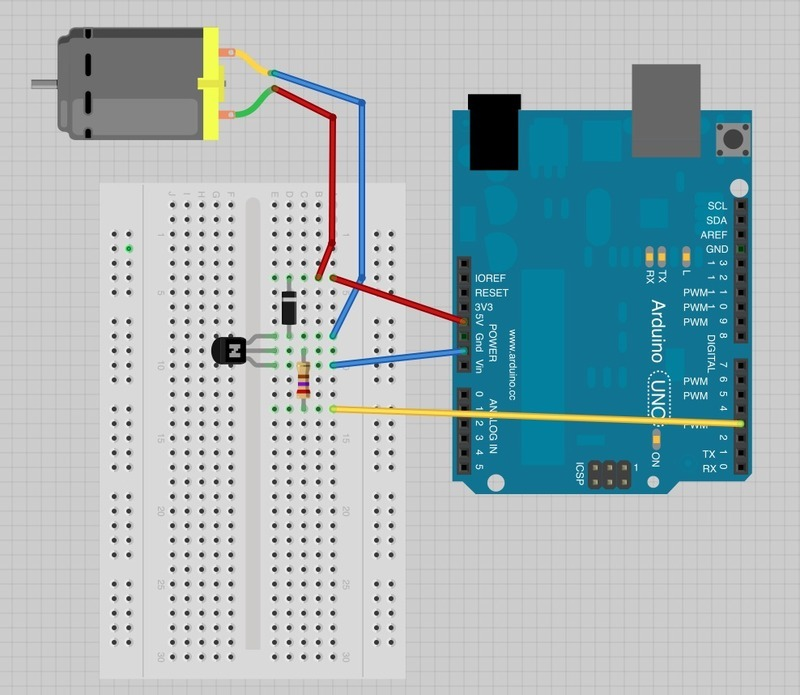
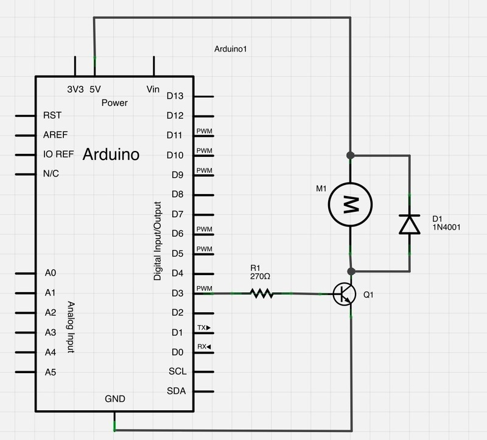

The project illustrates control of dc motor with fan.  

Parts:  
- Small 6V DC Motor  
- PN2222 Transistor  
- 1N4001 diode  
- 270 Ohm Resistor  

How to start dc motor:  
- Upload source code to Arduino  
- Open Serial monitor (right top button in Arduino ID)
- insert value from 0 to 255 => enter

