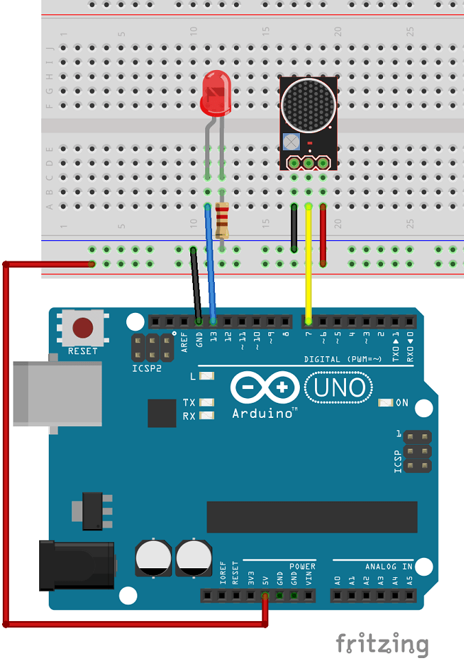

The project demonstrates integration with a microphone sound sensor

Parts:  
1x Microphone sound sensor  
Arduino UNO  
1x Breadboard  
1x LED  
1x 220 Ohm resistor  
Jumper wires  

Source of tutorial: https://randomnerdtutorials.com/guide-for-microphone-sound-sensor-with-arduino/
