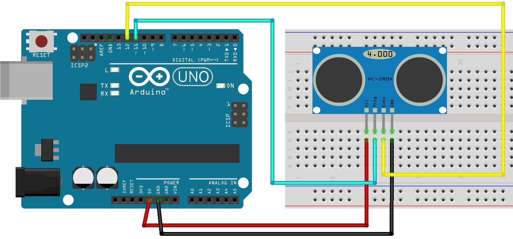

# Simple project with ultrasonic sensor HC-SR04

## Connection

| Sensor  | Arduino |
| ------------- | ------------- |
| VCC  | 5V  |
| Trig  | Pin 11  |
| Echo | Pin 12 |
| GND | GND |



[Original article](https://randomnerdtutorials.com/complete-guide-for-ultrasonic-sensor-hc-sr04/)

## Source code
```cpp
/* 
int trigPin = 11;    // Trigger
int echoPin = 12;    // Echo
long duration, cm, inches;
 
void setup() {
  //Serial Port begin
  Serial.begin (9600);
  //Define inputs and outputs
  pinMode(trigPin, OUTPUT);
  pinMode(echoPin, INPUT);
}
 
void loop() {
  // The sensor is triggered by a HIGH pulse of 10 or more microseconds.
  // Give a short LOW pulse beforehand to ensure a clean HIGH pulse:
  digitalWrite(trigPin, LOW);
  delayMicroseconds(5);
  digitalWrite(trigPin, HIGH);
  delayMicroseconds(10);
  digitalWrite(trigPin, LOW);
 
  // Read the signal from the sensor: a HIGH pulse whose
  // duration is the time (in microseconds) from the sending
  // of the ping to the reception of its echo off of an object.
  pinMode(echoPin, INPUT);
  duration = pulseIn(echoPin, HIGH);
 
  // Convert the time into a distance
  cm = (duration/2) / 29.1;     // Divide by 29.1 or multiply by 0.0343
  inches = (duration/2) / 74;   // Divide by 74 or multiply by 0.0135
  
  Serial.print(inches);
  Serial.print("in, ");
  Serial.print(cm);
  Serial.print("cm");
  Serial.println();
  
  delay(250);
}
```
