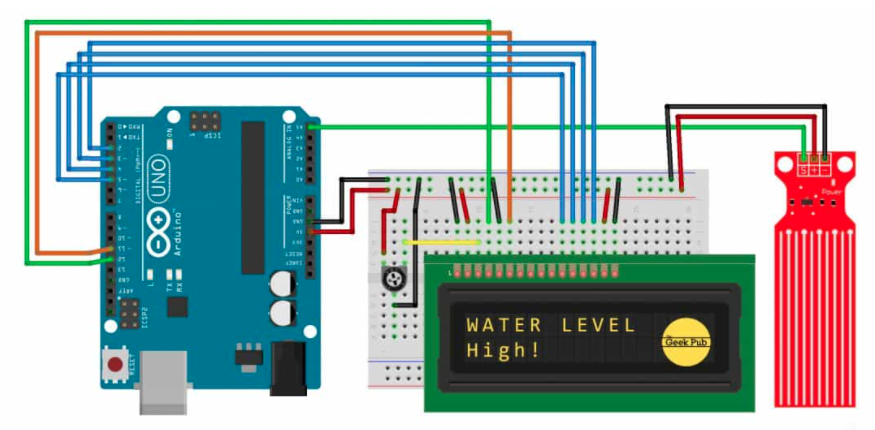

# Water sensor with LCD

[How to install lib to the project](https://docs.platformio.org/en/latest/librarymanager/quickstart.html#project-dependencies)  
[LiquidCrystal lib](https://github.com/arduino-libraries/LiquidCrystal)  

## Components
10K potentiometer

